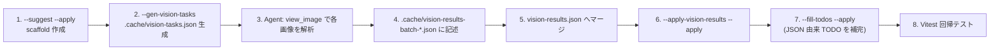

# AIHints 運用ガイド (Gemini / ChatGPT / NovelAI 三環境対応)

## 1. 目的

各キャラクターレコードに付与する `AIHints` フィールドは、**画像生成 AI に対してそのキャラクターの視覚的特徴を再現するためのヒント**を提供するためのものです。

GitHub 上に AI タグを置いただけでは、現在の生成 AI（ChatGPT 画像生成 / Gemini / NovelAI 等）は自動的にそれを参照しません。`AIHints` は **生成時にユーザーが手動でプロンプトへ貼り付けて利用すること**を前提に設計されています。

---

## 2. 二層構造 (common + forms)

ナンバーテールズ等の作品では、同一キャラクターが「**コアフォルダ形態 (装備姿)**」と「**ヒューマノイド形態 (人型 通常姿)**」のように複数の姿を持つことがあります。これを正しく区別するため、`AIHints` は **二層構造** を採用します。

```jsonc
"AIHints": {
  "common": {
    // 形態に依存しない素体特徴 (耳の種類・髪色・尻尾本数・表情傾向・年齢感・素体配色)
  },
  "forms": {
    "corefolder": { /* コアフォルダ形態 (装備姿) */ },
    "humanoid":   { /* ヒューマノイド形態 (人型 通常姿) */ }
  }
}
```

- `common` は **形態を問わず不変な素体特徴**を保持します。素体に紐づく `palette_priority` も `common` に置きます。
- `forms.<form>` は **その形態固有の衣装・装備・形態識別タグ・参照画像・即貼付プロンプト**を保持します。
- 画像の存在しない形態 (例: ヒューマノイド姿のイラスト未制作) は、対応する `forms.<form>` を **省略可** とします。`forms.<form>.reference_images` のみを省略しても構いません。

---

## 3. `common` 層のフィールド

| フィールド                     | 型          | 役割                                                                            | 主な対象環境      |
| ------------------------------ | ----------- | ------------------------------------------------------------------------------- | ----------------- |
| `identity_tags`                | `#String[]` | 一発で識別できる**素体**の視覚記号 (3〜5個)。耳の種類・尾の本数・固有モチーフ等 | 全環境            |
| `silhouette_features`          | `#String[]` | シルエットレベルで見える**素体**形状特徴                                        | 全環境            |
| `immutable_traits`             | `#String[]` | 変更してはいけない**素体**不変特徴                                              | 全環境 (識別保持) |
| `expression_tendency`          | `#String[]` | 表情の傾向(既定 / 状況別)                                                       | 全環境            |
| `age_appearance`               | `#String`   | 見た目年齢感                                                                    | 全環境            |
| `palette_priority`             | `object`    | **素体**の主色 / 補助色 / 差し色 (髪・瞳など)                                   | 全環境            |
| `natural_language_description` | `#String`   | **素体**を述べる短文の英語サマリ (1〜2文)                                       | Gemini / ChatGPT  |

---

## 4. `forms.<form>` 層のフィールド

| フィールド                     | 型          | 役割                                                                                               | 主な対象環境        |
| ------------------------------ | ----------- | -------------------------------------------------------------------------------------------------- | ------------------- |
| `form_tags`                    | `#String[]` | 形態識別タグ。**先頭に `"corefolder form"` または `"humanoid form"`** を必ず含める                 | 全環境 (必須)       |
| `outfit_features`              | `#String[]` | この形態固有の衣装・装備特徴 (ハーネス・コート・装甲等)                                            | 全環境              |
| `ai_tags`                      | `#String[]` | 順序付き完全タグ列 (`common` から合成済 + `form_tags` + `outfit_features`)。即貼付前提のフラット列 | 全環境 (NovelAI 強) |
| `negative_visuals`             | `#String[]` | この形態固有の禁止視覚要素 (素体共通のNGに加えて、その形態で特に避けたい要素)                      | NovelAI / SD        |
| `natural_language_description` | `#String`   | この形態を述べる短文の英語サマリ (1〜2文)                                                          | Gemini / ChatGPT    |
| `prompt_export`                | `#String`   | NovelAI / SD 向けの即貼付用カンマ区切り英語タグ列 (この形態用)                                     | NovelAI / SD        |
| `negative_prompt_export`       | `#String`   | カンマ区切りのネガティブタグ列 (この形態用)                                                        | NovelAI / SD        |
| `reference_images`             | `object`    | この形態の参照画像 URL (main / face / silhouette / palette)                                        | Gemini / ChatGPT    |

### 4.1 形態識別タグの規約

- `forms.corefolder.form_tags` の先頭: `"corefolder form"` (必須)
- `forms.humanoid.form_tags` の先頭: `"humanoid form"` (必須)
- 補助タグ例: `"with safety device harness"`, `"casual private outfit"`, `"on-duty outfit"` 等

### 4.2 `ai_tags` の合成順 (前半が強く効くため統一)

```
[form_tags] → [1other/1girl 等の人物分類] → [age] → [hair] → [ears] → [tails] → [eyes/expression] → [outfit_features] → [motif] → [number 'N' marking]
```

例 (NumberTales #15 corefolder):

```
corefolder form, with safety device harness, 1other, young adult, pink hair,
right-side ponytail, fox ears, five branching fox tails, stoic minimal expression,
pale jacket, safety device harness on back, arms crossed stance, number '15' marking
```

### 4.3 用語統制

- Danbooru / NovelAI 互換語を優先する (`fox ears`, `1girl`, `short hair`, `military jacket` 等)
- プロジェクト固有の造語 (例: `branching fox tails`) は `identity_tags` / `silhouette_features` / `outfit_features` 側に隔離し、`prompt_export` 内では `multiple fox tails` のような互換語に置換する
- 色は slash 併記 (`salmon pink / coral red`) を **`prompt_export` では避ける**。`palette_priority` および `ai_tags` では主名のみを使い、別名併記が必要なら別タグに分割する

### 4.4 英語表記の原則

- すべての AI 系タグ・自然文は **英語固定**
- 元データ (JSON 内の日本語設定) およびキャラクターイラストの両方を「正」とする
  1. JSON 内の日本語特徴 (髪色、装飾、配色など) を**忠実に英訳**する
  2. イラストから読み取れる視覚特徴を**適切な英語タグ**で表現する
- 両者に乖離がある場合は、まずイラストを優先しつつ、JSON 設定との整合を保つよう調整する

---

## 5. 環境別の使い方

### 5.1 NovelAI / Stable Diffusion 系

形態を選んだうえで、その形態の `prompt_export` / `negative_prompt_export` を貼り付けます。

```
positive prompt: <forms.<form>.prompt_export をそのまま貼付>
negative prompt: <forms.<form>.negative_prompt_export をそのまま貼付>
```

### 5.2 ChatGPT (DALL-E 系)

```
このキャラクターを描いてください。

[素体特徴]
<common.natural_language_description>

[今回の姿]
<forms.<form>.natural_language_description>

[識別記号 (必須)]
<common.identity_tags>
<forms.<form>.form_tags>

[避けるべき要素]
<forms.<form>.negative_visuals>
```

### 5.3 Gemini

```
以下の画像を参考に、同じキャラクターを別ポーズで描いてください。

参照画像: <forms.<form>.reference_images.main>

[素体特徴]
<common.natural_language_description>

[今回の姿]
<forms.<form>.natural_language_description>

[識別記号]
<common.identity_tags>
<forms.<form>.form_tags>
```

---

## 6. `reference_images` の URL 規約

GitHub Pages の公開ドメインを使用する:

```
https://database.numbertales-radiann.net/data/Works_<作品名>/Images/DB_<DB種別>/<サブフォルダ>/<ファイル名>
```

例 (NumberTales #15 corefolder):

```
https://database.numbertales-radiann.net/data/Works_NumberTales/Images/DB_Primary/corefolder/emstk_corefolder15-1.png
```

例 (NumberTales #17 humanoid):

```
https://database.numbertales-radiann.net/data/Works_NumberTales/Images/DB_Primary/humanoids/2024/art_img17-humanoidHardStudy.png
```

種別:

- `main`: その形態の全身代表画 (推奨)
- `face`: 顔アップ (任意)
- `silhouette`: シルエット / 後ろ姿 (任意)
- `palette`: カラースキーム参照 (任意)

---

## 7. 付与対象の判定

| キャラの状態                                     | AIHints 付与                                                                                                  |
| ------------------------------------------------ | ------------------------------------------------------------------------------------------------------------- |
| 画像 / イラスト**あり**                          | **必須**。`common.identity_tags` を 3〜5個必ず含める。対応する `forms.<form>` を付与する                      |
| 画像 / イラスト**なし** (設定のみ)               | 任意。付与する場合でも `forms.<form>.reference_images` は省略し、`identity_tags` は設定から推測した範囲に限る |
| `"Progress": "notProceeded"`                     | 付与不要                                                                                                      |
| ある形態の画像のみ存在 (例: corefolder 画像のみ) | 存在する形態の `forms.<form>` のみを付与し、もう一方は省略                                                    |

---

## 8. 既存タグからの移行履歴

- **2026-05-30 (二層構造化)**: `AIHints` を `common` + `forms.{corefolder,humanoid}` の二層構造へ再編。旧フラット構造 (`ai_tags`/`prompt_export`/`reference_images` がトップレベル) は廃止。コアフォルダ装着姿と人型通常姿を明確に区別できるように。
- **2026-05-30 (3環境対応リファクタ)**: 旧フィールドの `motif_rendering` / `distinguish_from` は廃止し、`identity_tags` に統合。長文・複合表現は原子化。
- 詳細は `CHANGELOG.md` および `_work_in_progress/2026-05-30_progress_aihints-twolayer.md` を参照。

---

## 9. Agent セッション再現用プレイブック（AIHints 視覚解析・連続充填）

> **適用範囲の明示 (重要)**
>
> 本セクションで記述するフロー、コマンド例、`tools/patch-aihints.mjs` の各モードの動作保証、および `.cache/fill-residual-todos.mjs` の挙動は **`data/Works_NumberTales/DataBases/db_Primary.json` のみを対象に検証・適用されている**。
>
> 他作品（`Works_FLInvestigator78` / `Works_ShouArRiders` / `Works_SinisterChangingGirls` / `Works_UnauthedLogica` / `Works_PastDivers` / `Works_DestinyFoxRecords` / `Works_Proxies`）や、同じ `Works_NumberTales` 内の他 DB（`Secondary` / `SemiPrimary` / `SelfSecondary` / `Proxy` 等）へ適用する際は、画像ディレクトリ構造・`Images.*_PNGPath` 規則・作品別 schema（`db_type.json($VersDef)`）の差異を個別に検証の上、`--work` / `--db` の両オプションと画像パス解決ロジックを随時調整してください。

### 9.1 ワークフロー全体像



### 9.2 各ステップの標準コマンド（`Works_NumberTales` / `DB_Primary` 前提）

#### Step 1: AIHints scaffold 作成（初期付与・レコード追加時のみ）

```powershell
# 個別に指定（数値・特殊番号を混在可能）
node tools/patch-aihints.mjs --records "97-99,000,2-alt,10-alt" --suggest --apply
```

- `--records` は `41-60` / `41,42,47` / `000` / `2-alt` / `10-alt` / `67-old` などを混在できる。
- 画像が一枚も見つからないレコードは `skipped-no-image` となり AIHints は作成されない。

#### Step 2: 視覚解析タスク生成

```powershell
node tools/patch-aihints.mjs --gen-vision-tasks
# → .cache/vision-tasks.json
```

#### Step 3: Agent による画像解析（1 セッションあたり最大 20 画像まで）

- Agent は `view_image` を並列呼び出しし、`vision-tasks.json` の `localPath` を順に参照して以下を記録する:
  - `palette` (`primary` / `secondary` / `accent`)
  - `silhouetteHair` / `silhouetteEye`
  - `aiTagsHair` / `aiTagsEye`
  - `corefolderOutfit[]`
  - `humanoidOutfit[]`（humanoid 画像がある場合のみ）
- **参照画像がないレコードは AI タグの付与をスキップする**（AIHints 未付与のまま保持）。現状 `Works_NumberTales/DB_Primary` では #38, #54, #59, #67-old, #79, #80, #82, #83, #90, #91, #95, #0, #00 が該当。

#### Step 4: バッチファイルに記述

```jsonc
// .cache/vision-results-batch-<range>.json
[
  {
    "num": 97,                              // number or string（例: "2-alt"）
    "palette": { "primary": "#5878C8", "secondary": "#A0A8C0", "accent": "#6850A0" },
    "silhouetteHair": "very long blue hair with side braid",
    "silhouetteEye": "pale lavender-gray eyes",
    "aiTagsHair": "very long blue hair with side braid",
    "aiTagsEye": "pale lavender-gray eyes",
    "corefolderOutfit": [ "gray nun-like top hat with cross emblem", "..." ],
    "humanoidOutfit":   [ "gray priestess-style top hat ...", "..." ]  // 任意
  }
]
```

#### Step 5: `vision-results.json` へマージ

```powershell
node -e "const fs=require('fs');const cur=JSON.parse(fs.readFileSync('.cache/vision-results.json','utf8'));const add=JSON.parse(fs.readFileSync('.cache/vision-results-batch-97-99-special.json','utf8'));const map=new Map(cur.map(e=>[e.num,e]));for(const e of add)map.set(e.num,e);const arr=[...map.values()];arr.sort((a,b)=>{const na=typeof a.num==='number'?a.num:9999;const nb=typeof b.num==='number'?b.num:9999;if(na!==nb)return na-nb;return String(a.num).localeCompare(String(b.num));});fs.writeFileSync('.cache/vision-results.json',JSON.stringify(arr,null,2),'utf8');console.log('Total:',arr.length);"
```

- `num` に string（`"000"` / `"2-alt"` 等）も認識される。ソートは number を上位・string を末尾に集める規則。

#### Step 6: AIHints へ適用

```powershell
node tools/patch-aihints.mjs --apply-vision-results --apply
# → vision-applied=<N>, vision-unchanged=<M>, vision-no-result=<K>, skipped-no-aihints=<L>
```

#### Step 7: JSON 由来 TODO 一括補完

```powershell
node .cache/fill-residual-todos.mjs --apply
```

- `extractExpressionHints(Character)` / `parseTailsUnit(TailsUnit)` を使い、`expression` / `age` / `tail` / `ear` / `forms.*.natural_language_description` を JSON から補完する。
- **`common.natural_language_description` は補完対象外**（作品設定本文に踏み込むため User 手動入力推奨）。

#### Step 8: 回帰テスト

```powershell
.\node_modules\.bin\vitest.cmd run tests/data.sanity.test.js tests/sw.enrich.basic.test.js
```

### 9.3 特殊番号レコードの取り扱い

以下は `Works_NumberTales/DB_Primary` に現われる string 型 `Num` レコードの例と、それぞれへの AI タグ付与劤判定:

| `Num` | キャラ名 | 画像有無 | AI タグ付与 |
| --- | --- | --- | --- |
| `"000"` | チトセ | あり (concept / corefolder / humanoid) | 付与済 |
| `"2-alt"` | バイナ / ツギ二号 | あり (concept / corefolder) | 付与済 |
| `"10-alt"` | ディケ / ツナイ | あり (corefolder) | 付与済 |
| `"67-old"` | ムナ | なし | スキップ |
| `"0"` / `"00"` | 零シリーズ | なし | スキップ |

`tools/patch-aihints.mjs` は `parseRecordSpec()` / メインループ / `gen-vision-tasks` / humanoid 画像マッチ (`art_img(<num>)-humanoid`) の 4 箰所で **number と string の両型** を受け付けるよう拡張済み。正規表現も `art_img([0-9A-Za-z\-]+?)-humanoid` に拡張されているため、`art_img2-alt-humanoid` のような名前も将来適合できる。

### 9.4 チェックリスト（セッション終了時）

- [ ] `vision-results.json` のエントリ数がマージ前+追加分と一致
- [ ] `--apply-vision-results --apply` の `vision-applied` 件数が今回追加したレコード数と一致
- [ ] `tests/data.sanity.test.js` / `tests/sw.enrich.basic.test.js` が全件 pass
- [ ] バッチファイル (`.cache/vision-results-batch-*.json`) は .gitignore 対象の `.cache/` 配下のみに保持
- [ ] 他作品・他 DB へ適用する場合は **本セクションのフローが `Works_NumberTales/DB_Primary` 前提でか検証されていないこと**を必ず記録し、個別に画像パス解決・schema 差異を確認
