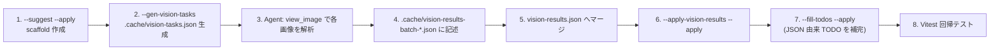

# AIHints 運用ガイド (Gemini / ChatGPT / NovelAI 三環境対応)

## 1. 目的

各キャラクターレコードに付与する `AIHints` フィールドは、**画像生成 AI に対してそのキャラクターの視覚的特徴を再現するためのヒント**を提供するためのものです。

GitHub 上に AI タグを置いただけでは、現在の生成 AI（ChatGPT 画像生成 / Gemini / NovelAI 等）は自動的にそれを参照しません。`AIHints` は **生成時にユーザーが手動でプロンプトへ貼り付けて利用すること**を前提に設計されています。

---

## 2. 二層構造 (common + forms)

ナンバーテールズ等の作品では、同一キャラクターが「**コアフォルダ形態 (装備姿)**」と「**ヒューマノイド形態 (人型 通常姿)**」のように複数の姿を持つことがあります。これを正しく区別するため、`AIHints` は **二層構造** を採用します。

```jsonc
"AIHints": {
  "common": {
    // 形態に依存しない素体特徴 (耳の種類・髪色・尻尾本数・表情傾向・年齢感・素体配色)
  },
  "forms": {
    "corefolder": { /* コアフォルダ形態 (装備姿) */ },
    "humanoid":   { /* ヒューマノイド形態 (人型 通常姿) */ }
  }
}
```

- `common` は **形態を問わず不変な素体特徴**を保持します。素体に紐づく `palette_priority` も `common` に置きます。
- `forms.<form>` は **その形態固有の衣装・装備・形態識別タグ・参照画像・即貼付プロンプト**を保持します。
- 画像の存在しない形態 (例: ヒューマノイド姿のイラスト未制作) は、対応する `forms.<form>` を **省略可** とします。`forms.<form>.reference_images` のみを省略しても構いません。

---

## 3. `common` 層のフィールド

| フィールド                     | 型          | 役割                                                                            | 主な対象環境      |
| ------------------------------ | ----------- | ------------------------------------------------------------------------------- | ----------------- |
| `identity_tags`                | `#String[]` | 一発で識別できる**素体**の視覚記号 (3〜5個)。耳の種類・尾の本数・固有モチーフ等 | 全環境            |
| `silhouette_features`          | `#String[]` | シルエットレベルで見える**素体**形状特徴                                        | 全環境            |
| `immutable_traits`             | `#String[]` | 変更してはいけない**素体**不変特徴                                              | 全環境 (識別保持) |
| `expression_tendency`          | `#String[]` | 表情の傾向(既定 / 状況別)                                                       | 全環境            |
| `age_appearance`               | `#String`   | 見た目年齢感                                                                    | 全環境            |
| `palette_priority`             | `object`    | **素体**の主色 / 補助色 / 差し色 (髪・瞳など)                                   | 全環境            |
| `natural_language_description` | `#String`   | **素体**を述べる短文の英語サマリ (1〜2文)                                       | Gemini / ChatGPT  |

---

## 4. `forms.<form>` 層のフィールド

| フィールド                     | 型                                  | 役割                                                                                                                                                                                                                                                                                                                                                                                                                                                                                        | 主な対象環境        |
| ------------------------------ | ----------------------------------- | ------------------------------------------------------------------------------------------------------------------------------------------------------------------------------------------------------------------------------------------------------------------------------------------------------------------------------------------------------------------------------------------------------------------------------------------------------------------------------------------- | ------------------- |
| `form_tags`                    | `#String[]`                         | 形態識別タグ。**先頭に `"corefolder form"` または `"humanoid form"`** を必ず含める                                                                                                                                                                                                                                                                                                                                                                                                          | 全環境 (必須)       |
| `outfit_features`              | `#String[]`                         | この形態固有の衣装・装備特徴 (ハーネス・コート・装甲等、キャラ固有の corefolder 装備等)                                                                                                                                                                                                                                                                                                                                                                                                     | 全環境              |
| `silhouette_notes`             | `object` (`$Def_AISilhouetteNotes`) | この形態のシルエットを `{ body_description: #String[], attached_items: #String[] }` の object 形式で構造化記述。`body_description` には素体（球体本体・球状コア・人型上半身など）の形状・色・突出部を列挙し、`attached_items` にはハーネス・髪飾り・首輪・カフ・襷・スカーフ等の装着付属品を列挙する。corefolder には球体本体の structural default を `body_description` へ投入し、キャラ固有スロットは `attached_items` に `TODO:` で残す。2026-06-09 以降は flat array 形式から自動移行済 | Gemini / ChatGPT    |
| `immutable_constraints`        | `#String[]`                         | この形態でキャラ単位に再宣言する不変制約。corefolder の structural default は `do not render arms or hands` / `do not render legs or feet` / `do not dress in humanoid casual / fashion outfit` の 3 項目。ハーネス保持制約は **15(トウゴ)固有** のキャラ固有スロットなので、他キャラには自動投入しない                                                                                                                                                                                     | 全環境              |
| `negative_keywords`            | `#String[]`                         | キャラ別ブラックリスト（`feet` / `legs` / `arms` / `hoodie` 等のフラットな NG キーワード）。corefolder の structural default は 10 項目を投入、humanoid は TODO のみ                                                                                                                                                                                                                                                                                                                        | NovelAI / SD        |
| `ai_tags`                      | `#String[]`                         | 順序付き完全タグ列 (`common` から合成済 + `form_tags` + `outfit_features`)。即貼付前提のフラット列                                                                                                                                                                                                                                                                                                                                                                                          | 全環境 (NovelAI 強) |
| `negative_visuals`             | `#String[]`                         | この形態固有の禁止視覚要素 (素体共通のNGに加えて、その形態で特に避けたい要素)                                                                                                                                                                                                                                                                                                                                                                                                               | NovelAI / SD        |
| `natural_language_description` | `#String`                           | この形態を述べる短文の英語サマリ (1〜2文)                                                                                                                                                                                                                                                                                                                                                                                                                                                   | Gemini / ChatGPT    |
| `prompt_export`                | `#String`                           | NovelAI / SD 向けの即貼付用カンマ区切り英語タグ列 (この形態用)                                                                                                                                                                                                                                                                                                                                                                                                                              | NovelAI / SD        |
| `negative_prompt_export`       | `#String`                           | カンマ区切りのネガティブタグ列 (この形態用)                                                                                                                                                                                                                                                                                                                                                                                                                                                 | NovelAI / SD        |
| `reference_images`             | `object`                            | この形態の参照画像 URL (main / face / silhouette / palette)                                                                                                                                                                                                                                                                                                                                                                                                                                 | Gemini / ChatGPT    |

> **トップレベル追加項目（2026-06-08）**: `$Def_AIHints` には `common` / `forms` の他に、作品共通の参照画像をまとめる `work_common.reference_images.{corefolder_reference[], humanoid_reference[]}` と、将来予約モードを格納する `alt_modes.corefolder_dressed.{allowed, outfit_source}` が追加されている。`work_common` は `--upgrade-schema` 適用時に `Images/Ref_Glossary/concept-figure/` 等から `cnsp-fg_*CoreFolder.png` / `cnsp-fg_*Humanoid.png` を自動収集する。

### 4.1 形態識別タグの規約

- `forms.corefolder.form_tags` の先頭: `"corefolder form"` (必須)
- `forms.humanoid.form_tags` の先頭: `"humanoid form"` (必須)
- 補助タグ例: `"with safety device harness"`, `"casual private outfit"`, `"on-duty outfit"` 等

### 4.2 `ai_tags` の合成順 (前半が強く効くため統一)

```
[form_tags] → [1other/1girl 等の人物分類] → [age] → [hair] → [ears] → [tails] → [eyes/expression] → [outfit_features] → [motif] → [number 'N' marking]
```

例 (NumberTales #15 corefolder):

```
corefolder form, with safety device harness, 1other, young adult, pink hair,
right-side ponytail, fox ears, five branching fox tails, stoic minimal expression,
pale jacket, safety device harness on back, arms crossed stance, number '15' marking
```

### 4.3 用語統制

- Danbooru / NovelAI 互換語を優先する (`fox ears`, `1girl`, `short hair`, `military jacket` 等)
- プロジェクト固有の造語 (例: `branching fox tails`) は `identity_tags` / `silhouette_features` / `outfit_features` 側に隔離し、`prompt_export` 内では `multiple fox tails` のような互換語に置換する
- 色は slash 併記 (`salmon pink / coral red`) を **`prompt_export` では避ける**。`palette_priority` および `ai_tags` では主名のみを使い、別名併記が必要なら別タグに分割する

### 4.4 英語表記の原則

- すべての AI 系タグ・自然文は **英語固定**
- 元データ (JSON 内の日本語設定) およびキャラクターイラストの両方を「正」とする
  1. JSON 内の日本語特徴 (髪色、装飾、配色など) を**忠実に英訳**する
  2. イラストから読み取れる視覚特徴を**適切な英語タグ**で表現する
- 両者に乖離がある場合は、まずイラストを優先しつつ、JSON 設定との整合を保つよう調整する

---

## 5. 環境別の使い方

### 5.1 NovelAI / Stable Diffusion 系

形態を選んだうえで、その形態の `prompt_export` / `negative_prompt_export` を貼り付けます。

```
positive prompt: <forms.<form>.prompt_export をそのまま貼付>
negative prompt: <forms.<form>.negative_prompt_export をそのまま貼付>
```

### 5.2 ChatGPT (DALL-E 系)

```
このキャラクターを描いてください。

[素体特徴]
<common.natural_language_description>

[今回の姿]
<forms.<form>.natural_language_description>

[識別記号 (必須)]
<common.identity_tags>
<forms.<form>.form_tags>

[避けるべき要素]
<forms.<form>.negative_visuals>
```

### 5.3 Gemini

```
以下の画像を参考に、同じキャラクターを別ポーズで描いてください。

参照画像: <forms.<form>.reference_images.main>

[素体特徴]
<common.natural_language_description>

[今回の姿]
<forms.<form>.natural_language_description>

[識別記号]
<common.identity_tags>
<forms.<form>.form_tags>
```

---

## 6. `reference_images` の URL 規約

GitHub Pages の公開ドメインを使用する:

```
https://database.numbertales-radiann.net/data/Works_<作品名>/Images/DB_<DB種別>/<サブフォルダ>/<ファイル名>
```

例 (NumberTales #15 corefolder):

```
https://database.numbertales-radiann.net/data/Works_NumberTales/Images/DB_Primary/corefolder/emstk_corefolder15-1.png
```

例 (NumberTales #17 humanoid):

```
https://database.numbertales-radiann.net/data/Works_NumberTales/Images/DB_Primary/arts/humanoids/2024/art_img17-humanoidHardStudy.png
```

種別:

- `main`: その形態の全身代表画 (推奨)
- `face`: 顔アップ (任意)
- `silhouette`: シルエット / 後ろ姿 (任意)
- `palette`: カラースキーム参照 (任意)

---

## 7. 付与対象の判定

| キャラの状態                                                  | AIHints 付与                                                                                                                                                                                                            |
| ------------------------------------------------------------- | ----------------------------------------------------------------------------------------------------------------------------------------------------------------------------------------------------------------------- |
| 画像 / イラスト**あり**                                       | **必須**。`common.identity_tags` を 3〜5個必ず含める。対応する `forms.<form>` を付与する                                                                                                                                |
| 画像 / イラスト**なし** (設定のみ)                            | 任意。付与する場合でも `forms.<form>.reference_images` は省略し、`identity_tags` は設定から推測した範囲に限る                                                                                                           |
| `Progress` が `AI_Unready` と宣言された段階                   | **付与不要**。scaffold 生成時に `skipped-progress` として soft skip する（`--include-ai-unready` で対象化）。既存 AIHints の保守モードは妨げない                                                                        |
| ある形態の画像のみ存在 (例: corefolder 画像のみ)              | 存在する形態の `forms.<form>` のみを付与し、もう一方は省略                                                                                                                                                              |
| `AI_Optout: true` が設定（DB または `_Secondaries` カテゴリ） | **付与不可**。DB レベルは `tools/patch-aihints.mjs` の全モードが exit 2 で拒否、カテゴリ単位は該当レコードを `skipped-ai-optout`（緊急時のみ `--force-ai-optout` でバイパス）。詳細は `docs/api-sw-spec.md` §5.5 を参照 |

### 「付与不可」と「付与不要」は別軸（重要）

上表の 2 つの否定は意味が異なり、実装も分かれている。

|          | `AI_Optout: true`                                                                          | `AI_Unready: true`                                                 |
| -------- | ------------------------------------------------------------------------------------------ | ------------------------------------------------------------------ |
| 意味     | **権利上の可否**（AI 学習・LLM 取り込みへの opt-out 表明）                                 | **進捗の成熟度**（まだ AIHints を作る段階でない）                  |
| 宣言場所 | `db_meta.json` の `Databases.#DB_*` / `_Secondaries[]`                                     | `db_meta.json` の `$EnumDef_Progress` の各エントリ                 |
| 強さ     | 付与不可（hard refusal）                                                                   | 付与不要（soft skip）                                              |
| 挙動     | DB レベルは exit 2 / カテゴリ単位はレコードスキップ。**既存 AIHints の保守モードも止める** | 新規 scaffold のみ見送り。`--resync-structural` 等の保守は妨げない |
| バイパス | `--force-ai-optout`                                                                        | `--include-ai-unready`                                             |

フラグを混ぜないこと。「まだ描けてないから AI へ渡したくない」を `AI_Optout` で表現すると、対外的には**権利上の opt-out 表明**として読まれてしまう（`docs/api-sw-spec.md` §5.5 の「意味論の境界」参照）。

#### `AI_Unready` の判定（スキーマ駆動）

対象語彙はツールに持たず、`$EnumDef_Progress` の宣言から解決する（`tools/patch-aihints.mjs` の `loadAiUnreadyProgressValues()`）。
解決順は **① `AI_Unready` の明示 → ② 未宣言なら `isForSecondary === true`**。

2026-07-17 時点で対象は 8 語:

| 判定 | Progress                                                                      | 根拠                                    |
| ---- | ----------------------------------------------------------------------------- | --------------------------------------- |
| 弾く | `notProceeded` / `stillTentative` / `nowCreating` / `archived`                | `AI_Unready: true` の明示               |
| 弾く | `founded` / `accepted` / `accepted\nnowRemaking` / `accepted\nremadeReleased` | `isForSecondary: true` のフォールバック |
| 通す | `unprofiled` / `unreleased` / `released(beta)` / `released` / `nowRecreating` | `AI_Unready: false` の明示              |

> `nowCreating`（制作中）は弾くが `nowRecreating`（再制作中）は通す。後者は既存デザインの作り直しであり、
> 素材が既にあるため。

**新しい進捗段階を追加するときは `AI_Unready` を明示すること**（`isForSecondary: true` の場合のみ省略可）。
どちらの網にもかからない値は黙って「許可側」へ落ちるため、`tests/data.shape.test.js` がこれを強制する。

> なお `AI_Unready` な Progress かつ画像ありの **scaffold 候補**は現状 SemiPrimary の Num 100（`stillTentative`）のみで、
> Primary / SelfSecondary では 0 件（`tests/patch-aihints.gates.test.js` が前提を固定）。
> Primary の Num `10-alt` は `stillTentative` かつ画像ありだが既に AIHints を持つため、前段の
> `skipped-existing` で落ちてゲートには到達しない。
> Progress ゲートは、未完成レコードに WIP 画像が 1 枚置かれた瞬間にガードが無音で消えるのを防ぐ保険であり、
> その場合に上表 1 行目（画像あり → 必須）ではなく本行（`AI_Unready` → 付与不要）を優先する、という決定でもある。

---

## 8. 既存タグからの移行履歴

- **2026-05-30 (二層構造化)**: `AIHints` を `common` + `forms.{corefolder,humanoid}` の二層構造へ再編。旧フラット構造 (`ai_tags`/`prompt_export`/`reference_images` がトップレベル) は廃止。コアフォルダ装着姿と人型通常姿を明確に区別できるように。
- **2026-05-30 (3環境対応リファクタ)**: 旧フィールドの `motif_rendering` / `distinguish_from` は廃止し、`identity_tags` に統合。長文・複合表現は原子化。
- 詳細は `CHANGELOG.md` および `_work_in_progress/2026-05-30_progress_aihints-twolayer.md` を参照。

---

## 9. Agent セッション再現用プレイブック（AIHints 視覚解析・連続充填）

> **適用範囲の明示 (重要)**
>
> 本セクションで記述するフロー、コマンド例、`tools/patch-aihints.mjs` の各モードの動作保証、および `.cache/fill-residual-todos.mjs` の挙動は **`data/Works_NumberTales/DataBases/db_Primary.json` を対象に検証・適用されている**。コマンド例はいずれも `--work NumberTales --db Primary` 前提であり、**Primary 以外を対象にする場合は `--work` / `--db` の両方を必ず明示すること**（省略時の既定値は `NumberTales` / `Primary`）。
>
> **`SemiPrimary` / `SelfSecondary`（2026-07-17）**: 基盤（`_Secondaries` のカテゴリ別 `AI_Optout` 解決 / `_Commons` 継承 / Class 辞書の合流 / Num ソート）は検証済みで、dry-run が期待どおり動くところまで確認している（`SemiPrimary`: `patched=9` / `SelfSecondary`: `patched=7`）。ただし **AIHints の実データはまだ 1 件も投入していない**（`AppearanceDetail` の入力が追い付いていないため）。両 DB には humanoid 画像が存在しないため、seed した場合 `forms.humanoid` は欠落する見込み。
>
> **`Secondary` / `Proxy` 等、および他作品**（`Works_FLInvestigator78` / `Works_ShouArRiders` / `Works_SinisterChangingGirls` / `Works_UnauthedLogica` / `Works_PastDivers` / `Works_DestinyFoxRecords`）へ適用する際は、画像ディレクトリ構造・`Images.*_PNGPath` 規則・作品別 schema（`db_type.json($VersDef)`）の差異を個別に検証の上、`--work` / `--db` の両オプションと画像パス解決ロジックを随時調整してください。なお `#DB_Secondary` は `_Secondaries` の各カテゴリが `AI_Optout: true`（第三者デザインを含むため）であり、対象外です。

### 9.1 ワークフロー全体像



### 9.2 各ステップの標準コマンド（`Works_NumberTales` / `DB_Primary` 前提）

#### Step 1: AIHints scaffold 作成（初期付与・レコード追加時のみ）

```powershell
# 個別に指定（数値・特殊番号を混在可能）
node tools/patch-aihints.mjs --records "97-99,000,2-alt,10-alt" --suggest --apply
```

- `--records` は `41-60` / `41,42,47` / `000` / `2-alt` / `10-alt` / `67-old` などを混在できる。
- 画像が一枚も見つからないレコードは `skipped-no-image` となり AIHints は作成されない。

#### Step 2: 視覚解析タスク生成

```powershell
node tools/patch-aihints.mjs --gen-vision-tasks
# → .cache/vision-tasks.json
```

#### Step 3: Agent による画像解析（1 セッションあたり最大 20 画像まで）

- Agent は `view_image` を並列呼び出しし、`vision-tasks.json` の `localPath` を順に参照して以下を記録する:
  - `palette` (`primary` / `secondary` / `accent`)
  - `silhouetteHair` / `silhouetteEye`
  - `aiTagsHair` / `aiTagsEye`
  - `corefolderOutfit[]`
  - `humanoidOutfit[]`（humanoid 画像がある場合のみ）
- **参照画像がないレコードは AI タグの付与をスキップする**（AIHints 未付与のまま保持）。現状 `Works_NumberTales/DB_Primary` では #38, #54, #59, #67-old, #79, #80, #82, #83, #90, #91, #95, #0, #00 が該当。

#### Step 4: バッチファイルに記述

```jsonc
// .cache/vision-results-batch-<range>.json
[
  {
    "num": 97, // number or string（例: "2-alt"）
    "palette": {
      "primary": "#5878C8",
      "secondary": "#A0A8C0",
      "accent": "#6850A0",
    },
    "silhouetteHair": "very long blue hair with side braid",
    "silhouetteEye": "pale lavender-gray eyes",
    "aiTagsHair": "very long blue hair with side braid",
    "aiTagsEye": "pale lavender-gray eyes",
    "corefolderOutfit": ["gray nun-like top hat with cross emblem", "..."],
    "humanoidOutfit": ["gray priestess-style top hat ...", "..."], // 任意
  },
]
```

#### Step 5: `vision-results.json` へマージ

```powershell
node -e "const fs=require('fs');const cur=JSON.parse(fs.readFileSync('.cache/vision-results.json','utf8'));const add=JSON.parse(fs.readFileSync('.cache/vision-results-batch-97-99-special.json','utf8'));const map=new Map(cur.map(e=>[e.num,e]));for(const e of add)map.set(e.num,e);const arr=[...map.values()];arr.sort((a,b)=>{const na=typeof a.num==='number'?a.num:9999;const nb=typeof b.num==='number'?b.num:9999;if(na!==nb)return na-nb;return String(a.num).localeCompare(String(b.num));});fs.writeFileSync('.cache/vision-results.json',JSON.stringify(arr,null,2),'utf8');console.log('Total:',arr.length);"
```

- `num` に string（`"000"` / `"2-alt"` 等）も認識される。ソートは number を上位・string を末尾に集める規則。

#### Step 6: AIHints へ適用

```powershell
node tools/patch-aihints.mjs --apply-vision-results --apply
# → vision-applied=<N>, vision-unchanged=<M>, vision-no-result=<K>, skipped-no-aihints=<L>
```

#### Step 7: JSON 由来 TODO 一括補完

```powershell
node .cache/fill-residual-todos.mjs --apply
```

- `extractExpressionHints(Character)` / `parseTailsUnit(TailsUnit, varsDef)` を使い、`expression` / `age` / `tail` / `ear` / `forms.*.natural_language_description` を JSON から補完する。`parseTailsUnit` は `TailsUnit` が構造化型 `$Def_TailsUnit[]` になったため `varsDef`（`loadMergedVarsDef(work)` の返り値）を第2引数に取る。この一回限りスクリプトは `.cache/`（Git 管轄外）に置かれ現存しないため、再作成する場合は新シグネチャに合わせること。
- **`common.natural_language_description` は補完対象外**（作品設定本文に踏み込むため User 手動入力推奨）。

#### Step 8: 回帰テスト

```powershell
.\node_modules\.bin\vitest.cmd run tests/data.sanity.test.js tests/sw.enrich.basic.test.js
```

### 9.3 特殊番号レコードの取り扱い

以下は `Works_NumberTales/DB_Primary` に現われる string 型 `Num` レコードの例と、それぞれへの AI タグ付与劤判定:

| `Num`          | キャラ名          | 画像有無                               | AI タグ付与 |
| -------------- | ----------------- | -------------------------------------- | ----------- |
| `"000"`        | チトセ            | あり (concept / corefolder / humanoid) | 付与済      |
| `"2-alt"`      | バイナ / ツギ二号 | あり (concept / corefolder)            | 付与済      |
| `"10-alt"`     | ディケ / ツナイ   | あり (corefolder)                      | 付与済      |
| `"67-old"`     | ムナ              | なし                                   | スキップ    |
| `"0"` / `"00"` | 零シリーズ        | なし                                   | スキップ    |

`tools/patch-aihints.mjs` は `parseRecordSpec()` / メインループ / `gen-vision-tasks` / humanoid 画像マッチ (`art_img(<num>)-humanoid`) の 4 箰所で **number と string の両型** を受け付けるよう拡張済み。正規表現も `art_img([0-9A-Za-z\-]+?)-humanoid` に拡張されているため、`art_img2-alt-humanoid` のような名前も将来適合できる。

### 9.4 チェックリスト（セッション終了時）

- [ ] `vision-results.json` のエントリ数がマージ前+追加分と一致
- [ ] `--apply-vision-results --apply` の `vision-applied` 件数が今回追加したレコード数と一致
- [ ] `tests/data.sanity.test.js` / `tests/sw.enrich.basic.test.js` が全件 pass
- [ ] バッチファイル (`.cache/vision-results-batch-*.json`) は .gitignore 対象の `.cache/` 配下のみに保持
- [ ] 他作品・他 DB へ適用する場合は **本セクションのフローが `Works_NumberTales/DB_Primary` 前提でか検証されていないこと**を必ず記録し、個別に画像パス解決・schema 差異を確認

### 9.5 `--upgrade-schema` モード（corefolder 強化フィールドの差分追加）

AIHints スキーマが拡張された際、既存レコードへ「差分追加のみ」を行うためのモード。**入力済み値は一切上書きしない**（`!('field' in obj)` ガード）。`AI_Optout` 設定済み DB はガードで拒否される。

#### 用途

- `$Def_AIFormVariant` に `silhouette_notes` / `immutable_constraints` / `negative_keywords` を追加した。
- `$Def_AIHints` トップレベルに `work_common` / `alt_modes` を追加した。
- 既存 92 レコード（NumberTales/DB_Primary）へ structural default と TODO プレースホルダを一括投入したい。

#### コマンド

```powershell
# dry-run（差分を確認）
node tools/patch-aihints.mjs --work NumberTales --db Primary --all --upgrade-schema

# 適用
node tools/patch-aihints.mjs --work NumberTales --db Primary --all --upgrade-schema --apply
# → schema-upgraded=<N>, schema-unchanged=<M>, skipped-no-aihints=<K>
```

#### 投入される内容

| スロット                               | corefolder の structural default                                                                   | humanoid の扱い                               |
| -------------------------------------- | -------------------------------------------------------------------------------------------------- | --------------------------------------------- |
| `forms.*.silhouette_notes`             | 球体本体記述（頭部が頂部から唯一突出）+ キャラ固有 TODO 1 行（ハーネス形状等はキャラ固有スロット） | TODO 1 行のみ（キャラ固有はすべて User 入力） |
| `forms.*.immutable_constraints`        | 腾/脈/手禁止 + humanoid 衣装禁止の 3 項目（ハーネス保持は **15固有**，他キャラに自動投入しない）   | TODO 1 行のみ                                 |
| `forms.*.negative_keywords`            | `feet/legs/shoes/high heels/arms/hands/hoodie/blazer/fashion outfit/bound by rope` の 10 項目      | TODO 1 行のみ                                 |
| `AIHints.work_common.reference_images` | `Images/Ref_Glossary/concept-figure/cnsp-fg_*CoreFolder.png` / `cnsp-fg_*Humanoid.png` を自動収集  | （同上、トップレベル）                        |
| `AIHints.alt_modes`                    | `null`（将来予約。`corefolder_dressed.{allowed, outfit_source}` を後日追加可）                     | （同上、トップレベル）                        |

#### 注意事項

- 既存レコードに同名フィールドが「キー定義済」なら、structural default は再投入されない（既存値を尊重）。
- キャラ固有の `silhouette_notes` / `immutable_constraints` / `negative_keywords` のキャラ固有エントリは `TODO:` で残るため、**User が画像と設定資料を見ながら手動入力する**ことを前提とする（Copilot による自動補完対象外）。
- `--apply-vision-results` 経由で `corefolderSilhouetteNotes[]` / `corefolderImmutableExtras[]` / `corefolderNegativeKeywords[]` / `humanoid*` 変種を渡すと、対応 TODO を置換または追記できる。重複は除去される。

### 9.6 `--migrate-silhouette-structure` モード（silhouette_notes 構造化）

2026-06-09 以降、`forms.*.silhouette_notes` は `#String[]` から `$Def_AISilhouetteNotes`（`{ body_description: #String[], attached_items: #String[] }`）へ移行された。本モードは既存の flat array 形式を **object 形式へ自動分割**し、`form_tags` / `outfit_features` / `silhouette_notes` / `immutable_constraints` / `negative_keywords` / `ai_tags` / ... のキー順を schema 宣言順に再整列する。

#### 分割ヒューリスティクス

- 「spherical / cushion-like / core body」等の素体記述は `body_description` へ。
- `harness` / `hairpin` / `hairband` / `hairclip` / `ribbon` / `collar` / `choker` / `scarf` / `cape` / `cloak` / `halo` / `wristband` / `cuffs` / `hood` / `accessory` / `wrapped around` / `draped` / `barrel-shaped` 等の装着具記述は `attached_items` へ。
- 判別不能なエントリは `body_description` 側に残す（安全側に倒す）。
- 既に object 形式のレコードは触らない（冪等）。

#### コマンド

```powershell
# dry-run
node tools/patch-aihints.mjs --work NumberTales --db Primary --all --migrate-silhouette-structure

# 適用
node tools/patch-aihints.mjs --work NumberTales --db Primary --all --migrate-silhouette-structure --apply
# → silhouette-migrated=<N>, silhouette-unchanged=<M>
```

### 9.7 `--rewrite-corefolder-nld` モード（corefolder NLD の球体本体テンプレ化）

`forms.corefolder.natural_language_description` をスキーマ駆動で再生成し、**humanoid 衣装語の混入と挙動描写の溢れ出しを防ぐ**ためのモード。

#### テンプレート

```
Corefolder form: a spherical cushion-like body in {base color}, with the number '{N}' {marking placement}; {accessory phrase}.
```

- `{base color}` は `silhouette_notes.body_description` または `attached_items` の英語フレーズから抽出（`"X base coloring"` / `"X fox with"` / `"X palette"` 等を検出）。抽出失敗時は `TODO: fill base color` を埋め込む。
- `{marking placement}` は `immutable_traits` の番号刻印記述から抽出。数字以外（ローマ数字・漢字・カタカナ・ひらがな等）にも対応。「番号刻印なし」と明示されたレコードは `with no number identifier printed on the body` を出力する。
- `{accessory phrase}` は `silhouette_notes.attached_items` の先頭 non-TODO エントリから抽出。複数装着具は `;` で繋ぐ。
- 「coat / dress / bodysuit / pants / shoes」等の humanoid 衣装語は出力しない（`shouldRewriteCorefolderNld()` が混入検知時に強制再生成する）。`outfit` は corefolder 衣装バリアント記述で正当な利用があるため除外語に含めない。

#### 既定の再生成条件

以下のいずれかに該当する既存 NLD は自動的に上書きされる:

- 空文字 / 未定義
- `[TRANSLATE:` 系プレースホルダ
- `A corefolder form character featuring ...` 形式（旧 scaffold）
- `TODO:` 残置
- humanoid 衣装語が含まれる
- テンプレート見出し `Corefolder form:` で始まらない

それ以外は維持される。`--force-rewrite-nld` を併用すると全件強制再生成。

#### コマンド

```powershell
# dry-run（差分プレビュー）
node tools/patch-aihints.mjs --work NumberTales --db Primary --all --rewrite-corefolder-nld

# 適用
node tools/patch-aihints.mjs --work NumberTales --db Primary --all --rewrite-corefolder-nld --apply
# → nld-rewritten=<N>, nld-unchanged=<M>

# 強制全件再生成
node tools/patch-aihints.mjs --work NumberTales --db Primary --all --rewrite-corefolder-nld --force-rewrite-nld --apply
```

#### 適用順の推奨

1. `--migrate-silhouette-structure --apply`（silhouette_notes を object 化）
2. キャラ個別の `immutable_traits` 内「番号刻印位置」を必要に応じて手動微修正（例: #57 のように本体表面位置を明示）
3. `--rewrite-corefolder-nld --apply`（テンプレ駆動で NLD を再生成）
4. `npm test` で `tests/aihints.schema.test.js` の corefolder NLD テンプレ準拠テストが通ることを確認

### 9.8 `--apply-identitymotif` モード（廃止済み）

`IdentityMotif` を単一正源として `AIHints` を再構築するモードとして 2026-06-09 に導入し、`Works_NumberTales/DB_Primary` へ適用していたが、`IdentityMotif` フィールド自体が develop 側で 2026-07-11 に `AppearanceDetail` へ一本化・廃止されたため、本モードのコード（`tools/patch-aihints.mjs` の `--apply-identitymotif` 一式）も同日に撤去した。以後は 9.9 の `--apply-appearancedetail` モードが唯一の AI タグ再構築モードとなる。

### 9.9 `--apply-appearancedetail` モード（AppearanceDetail 正源で AIHints 再構築）

`AppearanceDetail`（`Formation` × `DesignElement` × `BodyPart[]` × `Laterality` × `Attrs[]` の構造化フィールド）を正源に `AIHints` を再構築するモード。`Works_NumberTales/DB_Primary` へ実データ適用済みで、`--apply-identitymotif` 廃止後は唯一の AI タグ再構築モード。

#### 基本方針

- 正源は `AppearanceDetail[]`。`Formation: null`（共通）/ `corefolder` / `humanoid` の明示区分をそのまま `common` / `forms.<formation>` の振り分けに使う。
- `DesignElement` → カテゴリ対応（機械的、キャラ固有の創作判断なし）:
  - `Motif` / `BodyType` / `Ear` → body（`silhouette_features` / `silhouette_notes.body_description`）
  - `Expression` → `common.expression_tendency`
  - `CostumeItem` → `outfit_features`
  - `Halo` / `Emblem` / `Tag` → `silhouette_notes.attached_items`
  - `NumberMark` → `immutable_traits`（`common` へは `Formation: null` のエントリのみ反映。corefolder/humanoid で位置が異なるのが通常のため、大半は formation 側の `ai_tags` / NLD に反映される）
  - `TailsUnit` → 対象外（`TailsUnit` フィールドを構造的正源として使うため二重化を避ける。`TailsUnit` は現在 `$Def_TailsUnit[]`（`TailShapeType`/`Count`/`Segment`/`Branches`/`LayoutDirection`）の構造化型だが、この除外ルール自体は内部形状に関わらず変わらない）
- 尻尾本数・体格・年齢は `TailsUnit` / `Height_cm` / `ConceptAge` を構造的正源として優先する。
- `Attrs[]`（`vdict_*` / `value_*` / `about_*`）からの英語フレーズ合成は、`lib/section-renders/appearanceDetail.js`（UI 表示用）と同じ解決規約（`$EnumDef_*` を global + 作品ローカルでマージ）に揃えている。
- corefolder の `natural_language_description` は AppearanceDetail 由来の body_description / marking フレーズを直接連結して組み立てる。抽出できない部分は `TODO:` を残す。

#### コマンド

```powershell
# dry-run（件数確認）
node tools/patch-aihints.mjs --work NumberTales --db Primary --all --apply-appearancedetail

# 適用
node tools/patch-aihints.mjs --work NumberTales --db Primary --all --apply-appearancedetail --apply
# → appearancedetail-applied=<N>, appearancedetail-cleared=<M>, appearancedetail-unchanged=<K>, skipped-no-aihints=<L>
```

#### 集計ラベルの読み方

- `appearancedetail-applied`: AppearanceDetail を反映して再構築された。
- `appearancedetail-cleared`: AppearanceDetail が空で AI タグ系配列をクリア。
- `appearancedetail-no-source`: AppearanceDetail 自体が無く再構築できない。
- `skipped-no-aihints`: そもそも AIHints ブロックがない（モブ等）。

#### 注意事項

- `value_EN` が未入力で `value_JP` のみ存在する Attrs は `[JA] ...` を付けて出力し、警告ログ（`[apply-appearancedetail] ...`）に手動翻訳が必要な旨を記録する。創作内容の自動翻訳はしない。
- 既存 AIHints のスキーマ外トップレベルキー（例: `concept_contains_forms`）・form 単位のスキーマ外キーは変更せず保持する。
- キャラ固有の創作判断が必要な本文（固有描写・台詞・未公開設定）は本モードで自動生成しない。
- **`--force` による全面上書きは、人が書いた内容が残っているレコードでは安全のためブロックされる**（`--force-destructive` を明示しない限り上書きされない）。構造だけを最新化したい場合は 9.10 の `--resync-structural` を使う。

### 9.10 `--resync-structural` モード（provenance による構造的再同期）

構造由来の部分**だけ**を最新化し、人が手仕上げした内容には一切触れないモード。`--apply-appearancedetail --force`（全面上書き）の安全な代替であり、**構造ソースが変わったときの通常運用はこちらを使う**。

#### 基本方針

- **provenance の記録**: `AIHints._meta.structuralEntries` に「ツールが実際に挿入した文字列そのもの」をパス単位で記録する（例: `common.identity_tags` / `common.silhouette_features` / `forms.humanoid.form_tags`）。
- **find-exact-and-replace**: 再同期時は、記録と一致する文字列**だけ**を差し替える。人が追記・編集したタグは記録に無いため素通りする。これにより `--force` のような巻き戻り（手仕上げ内容の TODO 雛形化）が起きない。
- **no-op 判定**: `AIHints._meta.structuralSourceHash` が構造ソース（`TailsUnit` / `AppearanceDetail` / `ColorPalette` / `GenderType` / `ConceptAge` / `Height_cm` / `Num`）のハッシュと一致すれば、そのレコードは処理せず `resync-unchanged` を返す。
- **導出値の再生成**: `prompt_export` / `negative_prompt_export` はソース配列（`ai_tags` / `negative_visuals`）からの導出値のため、再同期の最後に `regenerateFormExports()` で常に作り直す。タグだけ更新して export が古いまま残る不整合（生成 AI へ渡る文字列と実データの食い違い）を防ぐ。
- `_meta` は `_DBLink` と同様の内部補助情報として扱い、UI / 公開 API へは露出させない。

#### コマンド

```powershell
# dry-run（差分確認）
node tools/patch-aihints.mjs --work NumberTales --db Primary --all --resync-structural

# 適用
node tools/patch-aihints.mjs --work NumberTales --db Primary --all --resync-structural --apply
# → resync-applied=<N>, resync-unchanged=<M>
```

#### 集計ラベルの読み方

- `resync-applied`: 構造ソースが変化しており、構造由来の記録済み文字列を差し替えた。
- `resync-unchanged`: `structuralSourceHash` が一致（構造ソース無変更）のため no-op。

#### CI 連携

`.github/workflows/aihints-structural-resync.yml` が `addon-ai-tag` への push で起動し、構造ソースに変化があれば再同期の PR を作成する。構造ソース無変更なら no-op で停止し PR は作られない。

> **制約**: `workflow_dispatch`（手動実行）は使えない。GitHub の仕様上、手動実行はデフォルトブランチ（`develop`）にワークフローファイルが存在しないと利用できないが、本ワークフローは AIHints 専用のため `addon-ai-tag` 限定である。手動で再同期したい場合はローカル実行して通常の PR を出す。

### 9.11 `--apply-colorpalette` モード（ColorPalette から palette_priority を機械導出）

`develop` 側の `ColorPalette`（設定画のカラーチップ由来の構造化フィールド）を正源に、`common.palette_priority` を機械導出するモード。**画像の目視は一切不要**。

#### 基本方針

- `ColorPalette[]` の `Role`（`#ColorRole_Primary` / `#ColorRole_Secondary` / `#ColorRole_Accent`）と `Hex` から `{ primary, secondary, accent }` を組み立てる。
- `#ColorRole_Sub`（副色）は `palette_priority` に対応スロットが無いため使わない。
- `ColorPalette` を持たないレコードは `null` を返し、**勝手に推定しない**（`palette-no-colorpalette`）。
- 既存の確定値は保護する。上書きしたい場合のみ `--force-palette` を指定する（`--apply-vision-results` と同じ規約）。
- `--apply-appearancedetail` は `palette_priority` を再構築せず据え置くため、本モードで入れた値が次回ビルドで潰れることはない。

#### コマンド

```powershell
# dry-run
node tools/patch-aihints.mjs --work NumberTales --db Primary --all --apply-colorpalette

# 適用
node tools/patch-aihints.mjs --work NumberTales --db Primary --all --apply-colorpalette --apply
# → palette-applied=<N>, palette-unchanged=<M>, palette-no-colorpalette=<K>

# 既存の確定値も上書きする
node tools/patch-aihints.mjs --work NumberTales --db Primary --all --apply-colorpalette --force-palette --apply
```

#### 集計ラベルの読み方

- `palette-applied`: `ColorPalette` から導出した HEX を `palette_priority` へ書き込んだ。
- `palette-unchanged`: 既に同じ値が入っている（または確定値を保護してスキップ）。
- `palette-no-colorpalette`: レコードに `ColorPalette` が無く導出できない。

#### 注意事項

- `ColorPalette` は `develop` 側の本体スキーマ（`data/db_type.json` の `ColorPalette` / `data/db_meta.json` の `$Def_ColorPalette`）であり、AIHints 非依存。作品・DB を跨いで同じ経路が使える。
- `Hex` は設定画のカラーチップ実測値であり、既存の創作物の転記にあたる（新規の創作内容を生成するものではない）。
- `ColorName_JP` / `ColorName_EN` / `Formation` / `Note_*` は創作内容のため本モードでは扱わない。
